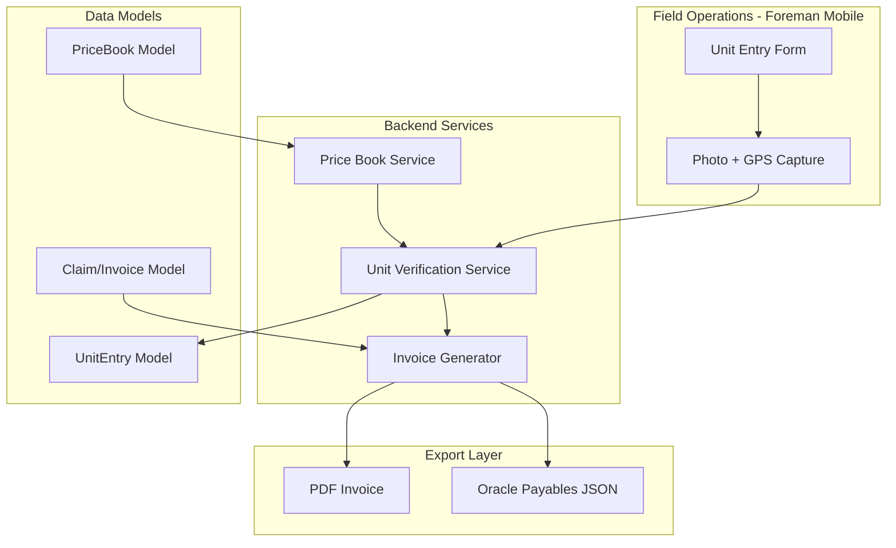

# Unit-Price Billing Module Implementation Plan

## Current State Analysis

Your codebase has strong foundations to build upon:
- **Job Model** ([backend/models/Job.js](backend/models/Job.js)) - Already has workflow states through `billed` and `invoiced`, plus document/photo storage
- **Company Model** ([backend/models/Company.js](backend/models/Company.js)) - Multi-tenant structure with utility associations
- **Utility Model** ([backend/models/Utility.js](backend/models/Utility.js)) - Has `sapIntegration` placeholder ready for Oracle
- **Photo Capture** ([frontend/src/components/OfflinePhotoCapture.jsx](frontend/src/components/OfflinePhotoCapture.jsx)) - Needs GPS enhancement but camera flow exists
- **Offline Support** - Already have offline-first architecture via `useOffline` hook

**Gap Analysis**: No GPS capture on photos, no price book model, no unit tracking, no invoice generation.

---

## Architecture Overview



---

## Phase 1: Data Models and Price Book (Weeks 1-2)

### 1.1 PriceBook Model
Create `backend/models/PriceBook.js` to store utility contract rates:

```javascript
// Key fields for Oracle compatibility
{
  utilityId: ObjectId,           // PG&E, SCE, etc.
  companyId: ObjectId,           // Which contractor has this rate sheet
  effectiveDate: Date,           // Rate validity period
  expirationDate: Date,
  items: [{
    itemCode: String,            // e.g., "UG-TRENCH-001"
    description: String,         // "Trenching - Normal Soil"
    unit: String,                // "LF" (linear feet), "EA" (each), "HR"
    unitPrice: Number,           // Contract rate
    category: String,            // "Civil", "EC/TAG", "Overhead", "Underground"
    subcategory: String,         // "Trenching", "Pole Work", etc.
    laborIncluded: Boolean,
    materialIncluded: Boolean,
    oracleItemId: String,        // For future Oracle mapping
  }],
  version: Number,               // Track rate updates
  importedBy: ObjectId,
  importedAt: Date
}
```

### 1.2 UnitEntry Model (The "Digital Receipt")
Create `backend/models/UnitEntry.js`:

```javascript
{
  jobId: ObjectId,
  companyId: ObjectId,
  priceBookItemId: ObjectId,     // Links to rate
  
  // The "Digital Receipt" - Core verification data
  quantity: Number,              // e.g., 50 (feet)
  unit: String,                  // "LF", "EA", etc.
  
  // Photo verification (required)
  photos: [{
    url: String,
    r2Key: String,
    capturedAt: Date,
    gpsCoordinates: {
      latitude: Number,
      longitude: Number,
      accuracy: Number,          // GPS accuracy in meters
      altitude: Number
    },
    deviceInfo: String           // "iPhone 14 Pro" for audit trail
  }],
  
  // Location verification
  gpsLocation: {
    latitude: Number,
    longitude: Number,
    accuracy: Number,
    capturedAt: Date
  },
  
  // Calculated from price book
  unitPrice: Number,             // Snapshot at time of entry
  totalAmount: Number,           // quantity * unitPrice
  
  // Workflow
  status: ['draft', 'submitted', 'verified', 'disputed', 'approved'],
  enteredBy: ObjectId,           // Foreman
  enteredAt: Date,
  verifiedBy: ObjectId,          // GF or QA
  verifiedAt: Date,
  
  // For disputes
  disputeReason: String,
  disputeResolution: String,
  
  notes: String
}
```

### 1.3 Claim/Invoice Model
Create `backend/models/Claim.js`:

```javascript
{
  jobId: ObjectId,
  companyId: ObjectId,
  claimNumber: String,           // Auto-generated "CLM-2026-00001"
  
  // Line items from UnitEntries
  lineItems: [{
    unitEntryId: ObjectId,
    itemCode: String,
    description: String,
    quantity: Number,
    unit: String,
    unitPrice: Number,
    totalAmount: Number,
    photoCount: Number,          // Verification indicator
    hasGPS: Boolean
  }],
  
  // Totals
  subtotal: Number,
  taxRate: Number,
  taxAmount: Number,
  totalAmount: Number,
  
  // Oracle-compatible fields
  oracleInvoiceNumber: String,
  oracleVendorId: String,
  oracleProjectId: String,
  paymentTerms: String,          // "Net 30"
  
  // Workflow
  status: ['draft', 'pending_review', 'submitted', 'approved', 'paid'],
  submittedAt: Date,
  approvedBy: ObjectId,
  approvedAt: Date,
  
  // Export tracking
  pdfUrl: String,
  oracleExportedAt: Date
}
```

---

## Phase 2: GPS-Enhanced Photo Capture (Week 2-3)

### 2.1 Enhance OfflinePhotoCapture
Modify [frontend/src/components/OfflinePhotoCapture.jsx](frontend/src/components/OfflinePhotoCapture.jsx) to capture GPS:

```javascript
// Add to photoData object
gpsCoordinates: {
  latitude: position.coords.latitude,
  longitude: position.coords.longitude,
  accuracy: position.coords.accuracy,
  altitude: position.coords.altitude,
  timestamp: position.timestamp
},
deviceInfo: navigator.userAgent
```

### 2.2 Create UnitEntryCapture Component
New component `frontend/src/components/UnitEntryCapture.jsx`:
- Select unit type from price book dropdown
- Enter quantity with unit display
- Capture required photo(s) with GPS
- Show GPS accuracy indicator
- Offline-capable with sync queue

---

## Phase 3: Foreman Unit Entry UI (Weeks 3-4)

### 3.1 Unit Entry Form (Mobile-First)
Create intuitive foreman interface:
- Category filter (Civil, EC/TAG, Overhead, Underground)
- Searchable unit picker from price book
- Quantity input with automatic $ calculation
- Camera integration with GPS validation
- Daily unit summary view

### 3.2 Unit Dashboard for GF/PM
- View all units entered by crew
- Approve/reject individual units
- Flag units for re-photo
- Export daily unit report

---

## Phase 4: Invoice Generation (Weeks 4-5)

### 4.1 Claim Builder Service
Backend service to aggregate units into claims:
- Group units by job
- Calculate totals with rate snapshots
- Generate claim number sequence
- Validate all units have photo/GPS

### 4.2 PDF Invoice Generator
Extend [backend/utils/templateGenerator.js](backend/utils/templateGenerator.js):
- Professional invoice PDF layout
- Photo thumbnails for each line item
- GPS coordinates per unit
- QR code linking to digital verification

### 4.3 Oracle Payables Export
Generate JSON matching Oracle REST API schema:
```javascript
{
  "InvoiceNumber": "CLM-2026-00001",
  "VendorNumber": "CONTRACTOR-001",
  "InvoiceDate": "2026-01-31",
  "InvoiceAmount": 15750.00,
  "lines": [{
    "LineNumber": 1,
    "Description": "Trenching - Normal Soil (50 LF)",
    "Quantity": 50,
    "UnitPrice": 25.00,
    "Amount": 1250.00,
    "ProjectNumber": "PM-35440499"
  }]
}
```

---

## Phase 5: Price Book Management (Week 5-6)

### 5.1 Admin Price Book Upload
- CSV/Excel import wizard
- Column mapping UI
- Validation and preview
- Version history

### 5.2 Rate Update Workflow
- New version creates new records (preserves history)
- Automatic notification to field when rates change
- Locked rates on submitted units (audit trail)

---

## Timeline Summary

| Phase | Weeks | Deliverable | Pilot Milestone |
|-------|-------|-------------|-----------------|
| 1 | 1-2 | Data models + Price Book import | GC can upload their PG&E rates |
| 2 | 2-3 | GPS-enhanced photo capture | "Digital Receipt" working |
| 3 | 3-4 | Foreman unit entry UI | Field crews capturing units |
| 4 | 4-5 | Invoice generation (PDF + Oracle JSON) | "One-Click Invoice" demo |
| 5 | 5-6 | Price Book management | Full rate update workflow |

**Total: 6 weeks to MVP with Oracle-compatible export**

---

## Key Success Metrics for Oracle Sit-Down

1. **Zero Rejection Rate**: Track % of units approved without dispute
2. **Photo Compliance**: 100% of units have GPS-verified photos
3. **Time Savings**: Measure invoice generation time vs. manual process
4. **Dollar Volume**: Track total $ processed through system

---

## Technical Decisions

1. **GPS Accuracy Threshold**: Require accuracy < 50m for verification
2. **Photo Requirements**: Minimum 1 photo per unit, stored in R2
3. **Rate Locking**: Snapshot unit price at entry time (prevents retroactive rate disputes)
4. **Offline Sync**: Units queue locally, sync with conflict resolution

---

## Files to Create/Modify

**New Backend Models:**
- `backend/models/PriceBook.js`
- `backend/models/UnitEntry.js`
- `backend/models/Claim.js`

**New Backend Routes:**
- `backend/routes/billing.routes.js`
- `backend/routes/pricebook.routes.js`

**New Frontend Components:**
- `frontend/src/components/UnitEntryCapture.jsx`
- `frontend/src/components/UnitDashboard.jsx`
- `frontend/src/components/PriceBookManager.jsx`
- `frontend/src/components/ClaimBuilder.jsx`

**Modified Files:**
- `frontend/src/components/OfflinePhotoCapture.jsx` (add GPS)
- `backend/utils/templateGenerator.js` (add invoice PDF)
- `frontend/src/App.jsx` (add routes)